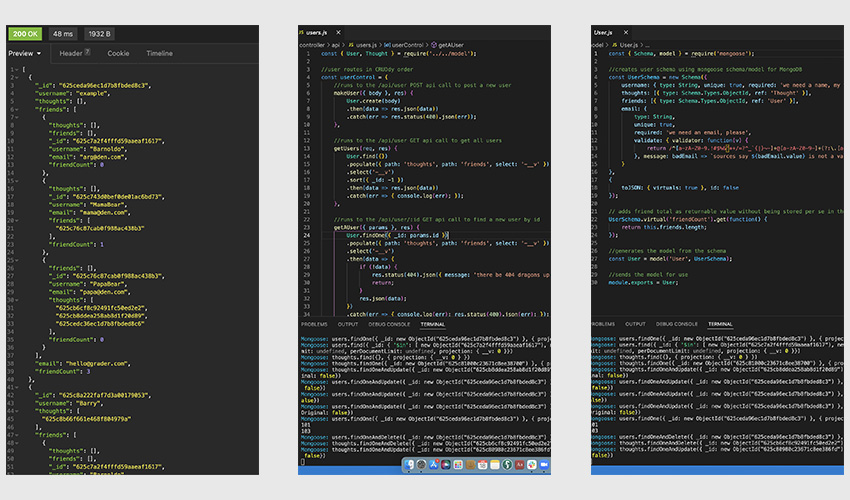

# metastasis 1.0
  

  

  [screencastify video](https://watch.screencastify.com/v/UPPwYBq5Kwvj4MtE6W9O)

  ## OVERVIEW:
   A Mongo DB database for a simple social network that would be able to grow and adapt quickly. The next generation of web titans may not be titans at all, but small, replicable distributed systems that will be controlled and understood by their users. This is a small step in that direction. Small, simple, and flexible databases written with todays current tools have the ability to grow and mature in ways that giant legacy systems do not. They are also less inherently static simply because they are not beholden to a literally invested board of directors. The ease with which these systems can be initialized, replicated, and shared is a viable challenge to established social networks.

  ## Table Of Contents:
  [Installation](README.md#installation) 
  [Usage](README.md#usage) 
  [Tests](README.md#tests) 
  [Credits](README.md#credits) 
  [Questions](README.md#questions) 
  [License](README.md#license) 

  ## Installation
  To run the database, install the node packages and run 'npm start'. The database will install and be available at http://localhost:3022

  ## Usage
  The routes/apiroutes.js file lays out the address endpoints for api calls.

  ## Tests
  No animals were harmed in the testing of this database, which was done entirely with the aptly named Insomnia.

  ## Credits
  This was built with JavaScript, using Node, Express, MongoDB, Mongoose, and all of the associated npm packages. Many thanks to all of the developers who have contributed to this ecosystem of code.

  ## Questions
  [Becket, Codeclast](becketbowes@gmail.com)
  [Github Page](http://www.github.com/becketbowes)

  ## License
  [Creative Commons Attribution Share-Alike License, Mon Apr 18 2022 01:04:41 GMT-0400 (Eastern Daylight Time)](https://creativecommons.org/licenses/by-sa/4.0/legalcode)
